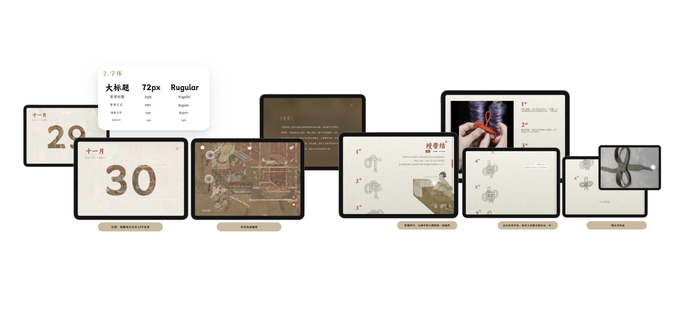
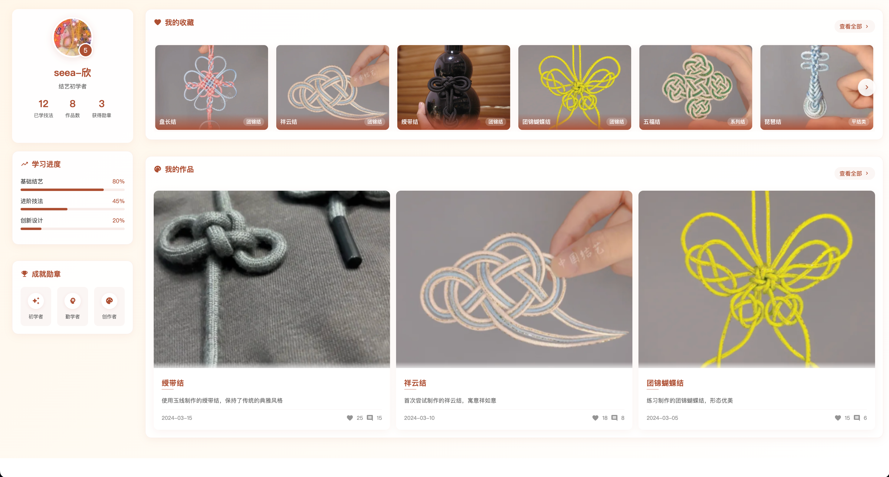

# 中国传统结艺文化学习平台

一个展示和学习中国传统结艺文化的Web平台。

## 预览

### 设计概念图

展示平台的整体设计理念，包括字体规范、日签功能、文化探索、结艺教程等模块。

### 个人中心界面

展示用户学习进度、收藏作品、个人作品等功能的界面设计。

## 功能模块

- 首页
- 结艺教程
- 文化探索
- 结艺工具
- 互动练习
- 作品展示
- 个人中心

## 技术栈

- HTML/CSS/JavaScript
- Express.js (服务器)
- Webpack (构建工具)
- Nginx (Web服务器)